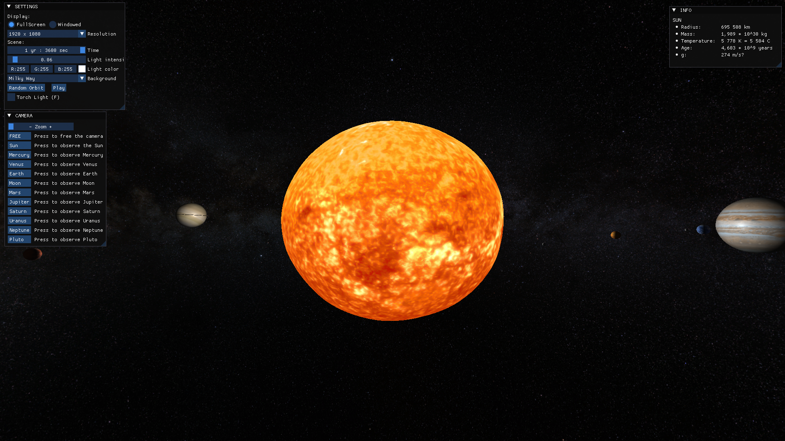
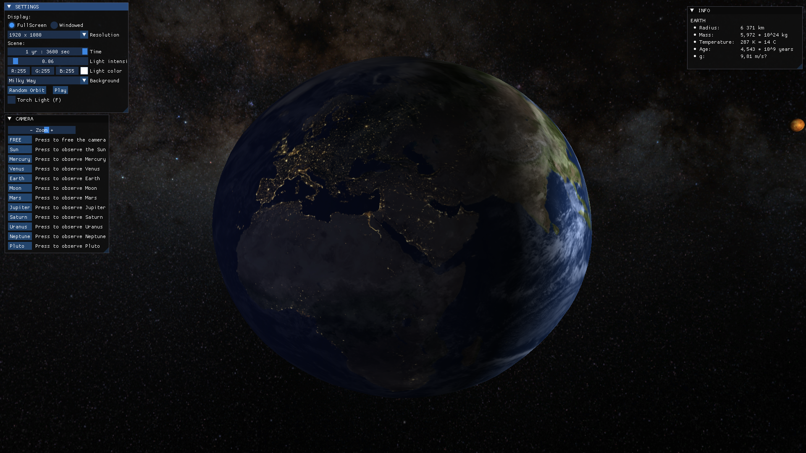
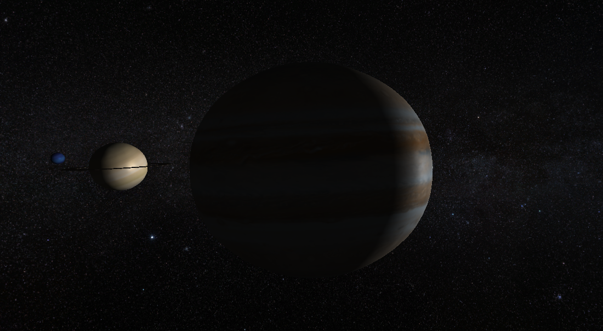
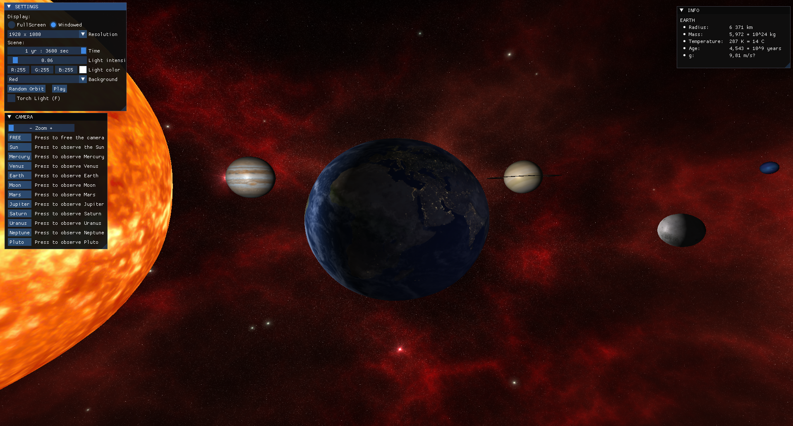

# 3D Solar System
This project is a 3D Solar System Simulation developed using OpenGL. It provides a realistic simulation featuring planetary orbits, rotation speeds, textures, and light interactions.

[Watch on YouTube](https://www.youtube.com/watch?v=gOsBw-IS0X8)
## Images from Project

    

    

    

    

